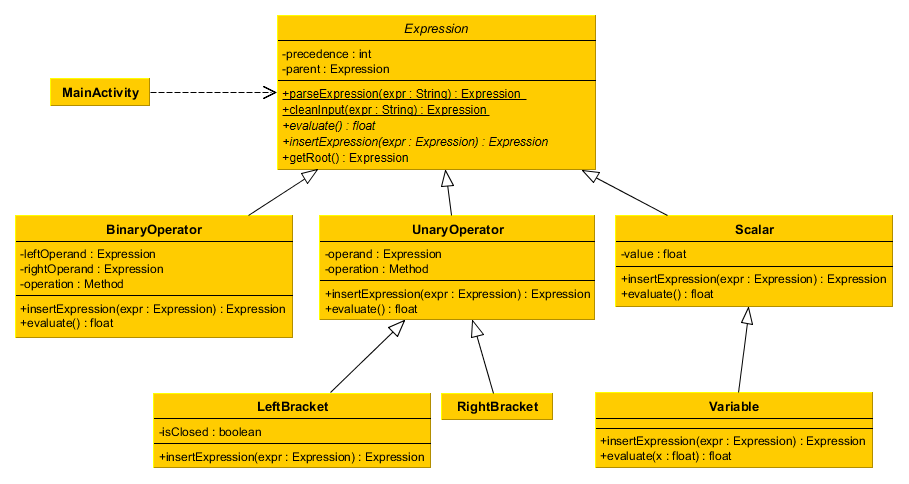
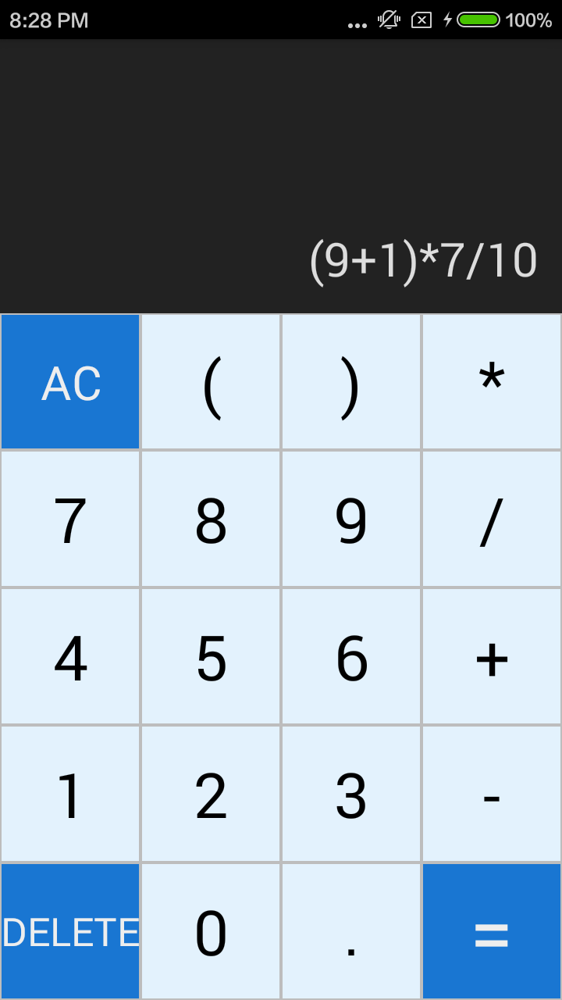
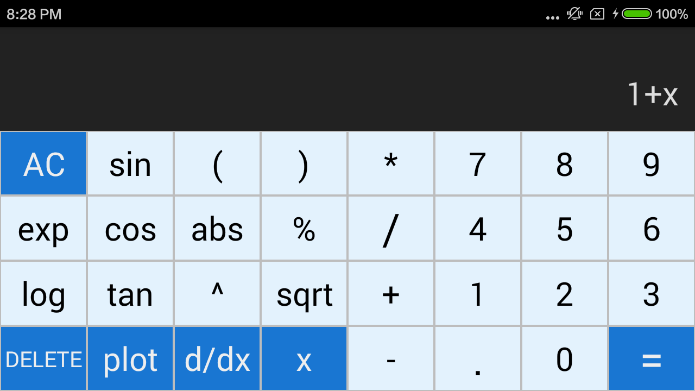
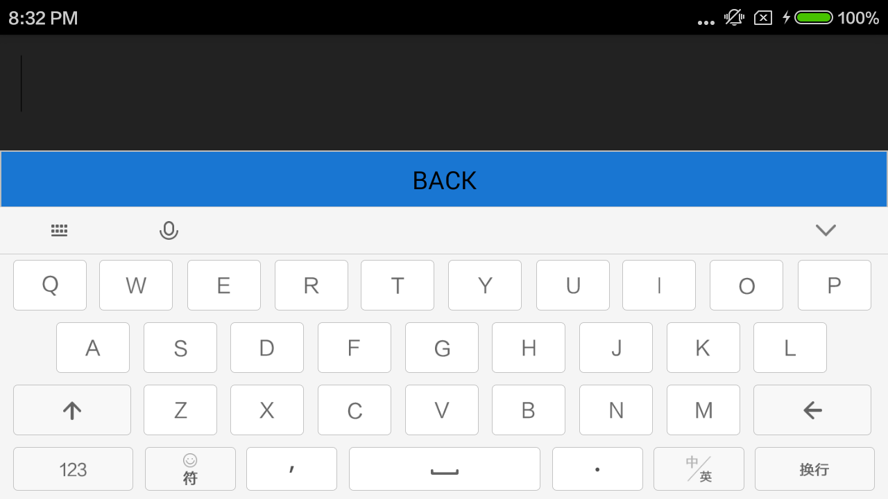
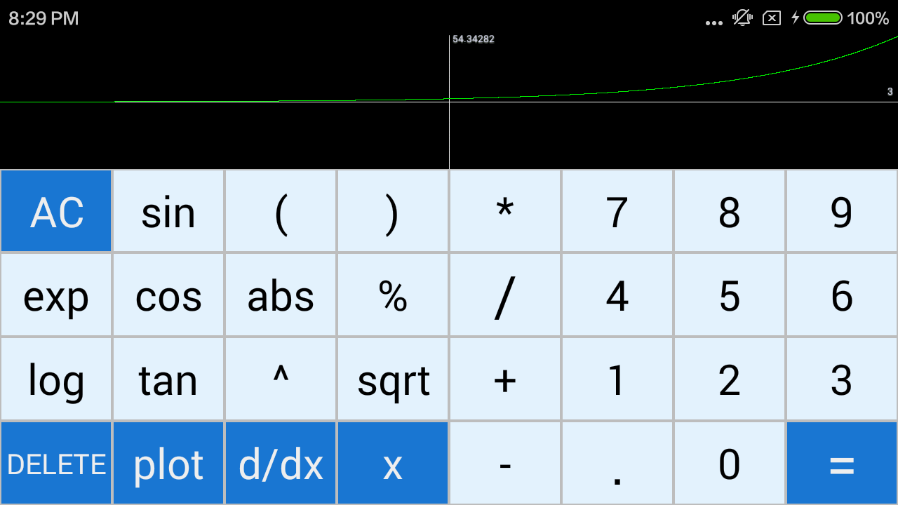

# COMP2100-ass2 Caculator by Nathan Frederick Elazar & Liyang(Leon) Guan  
  
## 1. Distribution Plan  
* Nathan  
  1. Expression Tree & Testing. 
  2. UI & Functionality of the 'x', 'plot', 'd/dx' button. 
  3. UML Diagram

* Liyang(Leon) 
  1. Parse method - addSpaceAndParse() & Testing.
  2. UI and button event handlers for both portrait and landscape modes.  
  3. Other documentations in wiki. 
  
  
## 2. Final UML Diagram  
 

## 3. Expression Parsing Algorithm

The expression parsing algorithm used creates the expression tree 'left-to-right', inserting each node into the appropriate place in the tree as they are fed to the algorithm. By having the algorithm remember where the most recently inserted node is and always attempting to join new nodes there, the tree can be constructed in a single pass over input String.

## 4. Final UI Design  

### Portrait Mode  

The display area at the top can be clicked to enable soft keyboard input. Buttons below enable user to type in expressions. 'AC' is designed to clean the display area. 'DELETE' is to delete the last character in the expression. Press '=' to evaluate the expression.  
  
### Landscape Mode
 

The display area at the top can be clicked to enable soft keyboard input. More available function buttons. 'x' is designed to add an 'x' variable to the expression. Clicking '=' once after adding an 'x' will allow user to put the desired x-value to evaluate the expression on a second click on '=' button. The 'd/dx' button allow user to differentiate the expression. This functionality does not require user press '=' after typing in the expression.  
  
  
The soft keyboard input mode.  
  
  
The 'plot' button will allow user to see the graph of a function. To disable the graph, simply press the 'plot' button again. This functionality also does not require user press '=' after typing in the expression.  
  
  
## 5. Testing Plan Summary  

### Junit Tests  
  1. Tests on ExpressionTree.  __ExpressionTreeTest.java [All passed]__  
  2. Tests on the parse method.  __ParseTest.java [All passed]__  
  
### Manual Tests
  1. The functionality of number and operator buttons on both portrait and landscape modes. __[Checked]__ 
  2. The functionality of 'AC' and 'DELETE' buttons. __[Checked]__  
  3. The logic inside '=' button. __[Checked]__
  4. The functionality of making an appropriate toast when error detected in expression. __[Checked]__ 
  5. The functionality of containing a variable 'x' in the expression and evaluating it. __[Checked]__  
  6. The functionality of displaying function graph and differentiating. __[Checked]__  
  7. The functionality of soft keyboard input. __[Checked]__  
  9. The robustness of trying to plot while evaluating a function. __[Checked]__
  10. The robustness of trying to evaluate while a plot is displayed. __[Checked]__
  11. The robustness of trying to differentiate while a plot is displayed. __[Checked]__

